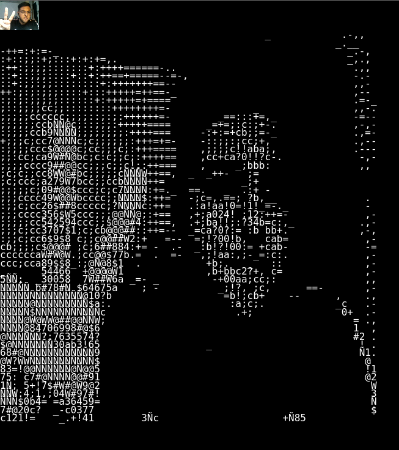

# Video_To_ASCII

Convert your camera feed into ASCII constants using P5.js


## Usage/Examples

```javascript
Just open index.html to use it
```


## Screenshots




## Run Locally

Clone the project

```bash
  git clone https://github.com/vansh7071/Video_To_ASCII.git
```

Go to the project directory

```bash
  cd Video_To_ASCII
```


Start the server

```bash
  Open index.html
```


## Deployment

To deploy this project run this on your browser

```bash
  https://editor.p5js.org/vansh7071/full/2XK2oCGI8
```


